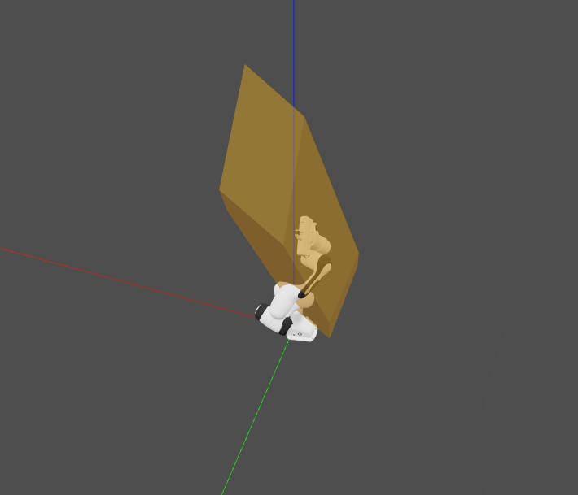
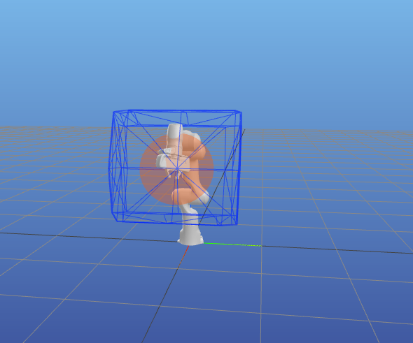

# An efficient task-space capacity calculation package for robotics and biomechanics


> 📢 New version of the pycapacity package is out - version v2.1.6! - [see full changelog](https://auctus-team.github.io/pycapacity/changelog.html)

## About 
[](https://pypi.org/project/pycapacity/) [](https://github.com/auctus-team/pycapacity/actions/workflows/python-app.yml)   [](https://github.com/auctus-team/pycapacity/actions/workflows/main.yml) [](https://joss.theoj.org/papers/73f155afc0dfa7730792639ac374b348)


## What is ``pycapacity``?

Python package ``pycapacity`` provides a set of tools for evaluating task space physical ability metrics for humans and robots, based on polytopes and ellipsoids. 
The aim of ``pycapacity`` is to provide a set of efficient tools for their evaluation in an easy to use framework that can be easily integrated with standard robotics 
and biomechanics libraries. The package implements several state of the art algorithms for polytope evaluation that bring many of the 
polytope metrics to the few milliseconds evaluation time, making it possible to use them in online and interactive applications. 

The package can be easily interfaced with standard libraries for robotic manipulator rigid body simulation such as ``robotic-toolbox`` 
or ``pinocchio``, as well as human musculoskeletal model biomechanics 
softwares ``opensim`` and ``biorbd``. The package can also be used with the Robot Operating System (``ROS``).

The package additionally implements a set of visualization tools for polytopes and ellipsoids based on the
Python package ``matplotlib`` intended for fast prototyping and quick and interactive visualization.


See [full API documentation and docs.](https://auctus-team.github.io/pycapacity/)

## Robotic manipulator capacity metrics


For the robotic manipulators the package integrates several velocity, force and acceleration capacity calculation functions based on ellipsoids:
- Velocity (manipulability) ellipsoid <br> `E_vel = {dx | dx = J.dq, ||dq||<1 }`
- Acceleration (dynamic manipulability) ellipsoid <br> `E_acc = {ddx | ddx = J.M^(-1).t, ||t||<1 }`
- Force ellipsoid <br> `E_for = {f | J^T.f = t, ||t||<1 }`

And polytopes: 
- Velocity polytope <br> `P_vel = {dx | dx = J.dq,  dq_min < dq < dq_max}`
- Acceleration polytope <br> `P_acc = {ddx | ddx = J.M^(-1).t, t_min < t < t_max}`
- Force polytope <br> `P_for = {f | J^T.f = t, t_min < t < t_max}`
- Reachable space of the robot with a horizon `T`  <br> `P_x = {x | x = JM(-1)tT^2/2, t_min < t < t_max,   dq_min < M^(-1)tT < dq_max,   q_min < M^(-1)tT^2/2 < q_max}`
- Force polytopes *Minkowski sum and intersection*
- **NEW** 📢: Sampling-based reachable space approximation with a horizon `T` <br> `C_x = {x | x = f(q0 + dq*T), q_min < q0 + dq*T < q_max,   dq_min < dq < dq_max}`

Where `J` is the robot jacobian matrix, `f` is the vector of cartesian forces,`dx` and `ddx` are vectors fo cartesian velocities and accretions, `dq` is the vector of the joint velocities and `t` is the vector of joint torques.

Reachable space polytope approximation is based on this paper: <br>
[**Approximating robot reachable space using convex polytopes**](https://arxiv.org/pdf/2211.17054.pdf)<br> by Skuric, Antun, Vincent Padois, and David Daney. <br> In: Human-Friendly Robotics 2022: HFR: 15th International Workshop on Human-Friendly Robotics. Cham: Springer International Publishing, 2023.

The force polytope functions have been implemented according to the paper:<br>
[**On-line force capability evaluation based on efficient polytope vertex search**](https://arxiv.org/abs/2011.05226)<br> 
by A.Skuric, V.Padois and D.Daney<br> Published on ICRA2021

The force polytope functions have been implemented according to the paper:<br>
[**On-line force capability evaluation based on efficient polytope vertex search**](https://arxiv.org/abs/2011.05226)<br> 
by A.Skuric, V.Padois and D.Daney<br> Published on ICRA2021

And the velocity and acceleration polytopes are resolved using the *Hyper-plane shifting method*:<br>
[**Characterization of Parallel Manipulator Available Wrench Set Facets**](http://www.lirmm.fr/krut/pdf/2010_gouttefarde_ark-0602650368/2010_gouttefarde_ark.pdf)<br>
by Gouttefarde M., Krut S. <br>In: Lenarcic J., Stanisic M. (eds) Advances in Robot Kinematics: Motion in Man and Machine. Springer, Dordrecht (2010)

## Human musculoskeletal models capacity metrics


For the human musculoskeletal models this package implements the ellipsoid and polytope evaluation functions. The implemented ellipsoids are:
- Velocity (manipulability) ellipsoid <br> `E_vel = {dx | dx = J.dq, dl = L.dq, ||dl||<1 }`
- Acceleration (dynamic manipulability) ellipsoid <br> `E_acc = {ddx | ddx = J.M^(-1).N.F, ||F||<1 }`
- Force ellipsoid <br> `E_for = {f | J^T.f = N.F, ||F||<1 }`

And polytopes: 
- Velocity polytope <br> `P_vel = {dx | dx = J.dq, dl = L.dq  dl_min < dl < dl_max}`
- Acceleration polytope <br> `P_acc = {ddx | ddx = J.M^(-1).N.F, F_min < F < F_max}`
- Force polytope <br> `P_for = {f | J^T.f = N.F, F_min < F < F_max}`

Where `J` is the model's jacobian matrix, `L` si the muscle length jacobian matrix, `N= -L^T` is the moment arm matrix, `f` is the vector of cartesian forces,`dx` and `ddx` are vectors fo cartesian velocities and accretions, `dq` is the vector of the joint velocities, `t` is the vector of joint torques, `dl` is the vector of the muscle stretching velocities and `F` is the vector of muscular forces. 

The force and velocity polytope functions have been implemented according to the paper:<br>
[**On-line feasible wrench polytope evaluation based on human musculoskeletal models: an iterative convex hull method**](https://hal.inria.fr/hal-03369576)<br> 
by A.Skuric, V.Padois, N.Rezzoug and D.Daney<br> Submitted to RAL & ICRA2022 

And the acceleration polytopes are resolved using the *Hyper-plane shifting method*:<br>
[**Characterization of Parallel Manipulator Available Wrench Set Facets**](http://www.lirmm.fr/krut/pdf/2010_gouttefarde_ark-0602650368/2010_gouttefarde_ark.pdf)<br>
by Gouttefarde M., Krut S. <br>In: Lenarcic J., Stanisic M. (eds) Advances in Robot Kinematics: Motion in Man and Machine. Springer, Dordrecht (2010)

## Polytope evaluation algorithms

There are three methods implemented in this paper to resolve all the polytope calculations:
- Hyper-plane shifting method (HPSM)
- Iterative convex hull method (ICHM)
- Vertex enumeration algorithm (VEPOLI2)

All of the methods are implemented in the module `pycapacity.algorithms` and can be used as standalone functions.  See in [docs for more info](https://auctus-team.github.io/pycapacity/pycapacity.algorithms.html#). 

### Hyper-plane shifting method (HPSM)

[**Characterization of Parallel Manipulator Available Wrench Set Facets**](http://www.lirmm.fr/krut/pdf/2010_gouttefarde_ark-0602650368/2010_gouttefarde_ark.pdf)<br>
by Gouttefarde M., Krut S. <br>In: Lenarcic J., Stanisic M. (eds) Advances in Robot Kinematics: Motion in Man and Machine. Springer, Dordrecht (2010)

This method finds the half-space representation of the polytope of a class:
```
P = {x | x = By, y_min <= y <= y_max }
```
To find the vertices of the polytope after finding the half-space representation `Hx <= d` an convex-hull algorithm is used. 

The method is a part of the `pycapacity.algorithms` module `hyper_plane_shift_method`, See in [docs for more info](https://auctus-team.github.io/pycapacity/pycapacity.algorithms.html#pycapacity.algorithms.hyper_plane_shift_method). 

### Iterative convex-hull method (ICHM)
[**On-line feasible wrench polytope evaluation based on human musculoskeletal models: an iterative convex hull method**](https://hal.inria.fr/hal-03369576)<br> 
by A.Skuric, V.Padois, N.Rezzoug and D.Daney<br> Submitted to RAL & ICRA2022 

This method finds both vertex and half-space representation of the class of polytopes:
```
P = {x | Ax = By, y_min <= y <= y_max }
``` 
And it can be additionally extended to the case where there is an additional projection matrix `P` making a class of problems:
```
P = {x | x= Pz, Az = By, y_min <= y <= y_max }
``` 

The method is a part of the `pycapacity.algorithms` module `iterative_convex_hull_method`. See the [docs for more info](https://auctus-team.github.io/pycapacity/pycapacity.algorithms.html#pycapacity.algorithms.iterative_convex_hull_method)

### Vertex enumeration algorithm (VEPOLI2)
[**On-line force capability evaluation based on efficient polytope vertex search**](https://arxiv.org/abs/2011.05226)<br> 
by A.Skuric, V.Padois and D.Daney<br> Published on ICRA2021

This method finds vertex representation of the class of polytopes:
```
P = {x | Ax = y, y_min <= y <= y_max }
``` 
To find the half-space representation (faces) of the polytope after finding the vertex representation  an convex-hull algorithm is used. 

The method is a part of the `pycapacity.algorithms` module `vertex_enumeration_vepoli2`. See the [docs for more info](https://auctus-team.github.io/pycapacity/pycapacity.algorithms.html#pycapacity.algorithms.vertex_enumeration_vepoli2)

## Installation

All you need to do to install it is:
```
pip install pycapacity
```
And include it to your python project
```python
import pycapacity.robot 
# and/or
import pycapacity.human 
#and/or
import pycapacity.algorithms 
#and/or
import pycapacity.visual 
#and/or
import pycapacity.objects 
```

Other way to install the code is by installing it directly from the git repo:
```
pip install git+https://github.com/auctus-team/pycapacity.git
```

### Package API docs

See full docs at the [link](https://auctus-team.github.io/pycapacity/)

## Contributing and discussions

For all the questions regarding the potential implementation, applications, supported hardware and similar please don't hesitate to leave an issue or start a [discussion](https://github.com/auctus-team/pycapacity/discussions)

It is always helpful to hear the stories/problems/suggestions of people implementing the code! 

### Github Issues & Pull requests

Please do not hesitate to leave an issue if you have problems/advices/suggestions regarding the code!

If you'd like to contribute to this project but you are not very familiar with github, don't worry, let us know either by starting the discussion or posting a github issue.


## Citing `pycapacity` in scientific publications

We are very happy that `pycapacity` has been used as a component of several research project and has made its way to several scientific papers. We are hoping that this trend is going to continue as the project matures and becomes more robust! 

A short resume paper about `pycapacity` has been published in the Journal of Open Source Software: 
<p>
  <b><i>pycapacity</i></b>: a real-time task-space capacity calculation package for robotics and biomechanics<br>
  A. Skuric, V. Padois and D. Daney<br>
Journal of Open Source Software, 8(89), 5670, https://doi.org/10.21105/joss.05670
</p>

If you are interested in citing  `pycapacity` in your research, we suggest you to cite our paper:

```bib
@article{Skuric2023pycapacity,
    author = {Skuric, Antun and Padois, Vincent and Daney, David},
    doi = {10.21105/joss.05670},
    journal = {Journal of Open Source Software},
    month = sep,
    number = {89},
    pages = {5670},
    title = {{Pycapacity: a real-time task-space capacity calculation package for robotics and biomechanics}},
    url = {https://joss.theoj.org/papers/10.21105/joss.05670},
    volume = {8},
    year = {2023}
}
```

## Code examples

See more examples in the [tutorials](https://auctus-team.github.io/pycapacity/examples/)

### An example code with robotics toolbox and swift visualisation

This code snippet shows how to calculate the force polytope of the Franka Emika Panda robot and visualise it in the Swift visualisation tool.

<details markdown="1"> <summary>Click to see the code</summary>

```python
import roboticstoolbox as rp
import numpy as np

panda = rp.models.DH.Panda()

# random initial pose    
q_min = np.array([-2.7437, -1.7837, -2.9007, -3.0421, -2.8065, 0.5445, -3.0159])
q_max = np.array([2.7437, 1.7837, 2.9007, -0.1518, 2.8065, 4.5169, 3.0159])
q= np.random.uniform(q_min,q_max)

panda.q = q
# joint torque limits
t_max = np.array([87, 87, 87, 87, 20, 20, 20]) 
t_min = -t_max

# polytope python module
import pycapacity.robot as pyc

# robot matrices
Jac = panda.jacob0(q)[:3,:]
# gravity torque
gravity = panda.gravload(q).reshape((-1,1))

# calculate for the polytope
f_poly =  pyc.force_polytope(Jac, t_max, t_min, gravity)
# calculate the face representation of the polytope
f_poly.find_faces()

 # visualise panda
panda = rp.models.Panda()
import swift.Swift as Swift
panda.q = q
env = Swift()
env.launch()
env.add(panda)


# polytope visualisation
import trimesh
# save polytope as mesh file
scaling = 500
# create the mesh
mesh = trimesh.Trimesh(vertices=(f_poly.vertices.T/scaling + panda.fkine(q).t),
                       faces=f_poly.face_indices, use_embree=True, validate=True)

# absolute path to the temporary polytope file saved 
# in the stl format
import os
file_path = os.path.join(os.getcwd(),'tmp_polytope_file.stl')
                  
f = open(file_path, "wb")
f.write(trimesh.exchange.stl.export_stl(mesh))
f.close()
# robot visualisation
from spatialgeometry import Mesh
poly_mesh = Mesh(file_path)
poly_mesh.color = (0.9,0.6,0.0,0.5)
env.add(poly_mesh)
```

</details>



See more examples in the [tutorials](https://auctus-team.github.io/pycapacity/examples/robotics_toolbox.html)

### An example with pinocchio library and meshcat visualisation

This example shows how to calculate the velocity polytope and ellipsoid of the Franka Emika Panda robot and visualise it in the Meshcat visualisation tool.


<details markdown="1"> <summary>Click to see the code</summary>

```python
import pinocchio as pin
import numpy as np
import time

from example_robot_data import load

# import pycapacity 
import pycapacity as pycap

# get panda robot usinf example_robot_data
robot = load('panda')

# get joint position ranges
q_max = robot.model.upperPositionLimit.T
q_min = robot.model.lowerPositionLimit.T
# get max velocity
dq_max = robot.model.velocityLimit
dq_min = -dq_max

# Use robot configuration.
# q0 = np.random.uniform(q_min,q_max)
q0 = (q_min+q_max)/2

# calculate the jacobian
data = robot.model.createData()
pin.framesForwardKinematics(robot.model,data,q0)
pin.computeJointJacobians(robot.model,data, q0)
J = pin.getFrameJacobian(robot.model, data, robot.model.getFrameId(robot.model.frames[-1].name), pin.LOCAL_WORLD_ALIGNED)
# use only position jacobian
J = J[:3,:]

# end-effector pose
Xee = data.oMf[robot.model.getFrameId(robot.model.frames[-1].name)]

## visualise the robot
from pinocchio.visualize import MeshcatVisualizer

viz = MeshcatVisualizer(robot.model, robot.collision_model, robot.visual_model)
# Start a new MeshCat server and client.
viz.initViewer(open=True)
# Load the robot in the viewer.
viz.loadViewerModel()
viz.display(q0)
# small time window for loading the model 
# if meshcat does not visualise the robot properly, augment the time
# it can be removed in most cases
time.sleep(0.2) 

## visualise the polytope and the ellipsoid
import meshcat.geometry as g 

# calculate the polytope
opt = {'calculate_faces':True}
# calculate the polytope
vel_poly = pycap.robot.velocity_polytope(J, dq_min, dq_max,options=opt)
# meshcat triangulated mesh
poly = g.TriangularMeshGeometry(vertices=vel_poly.vertices.T/10 + Xee.translation, faces=vel_poly.face_indices)
viz.viewer['poly'].set_object(poly, g.MeshBasicMaterial(color=0x0022ff, wireframe=True, linewidth=3, opacity=0.2))

# calculate the ellipsoid
vel_ellipsoid = pycap.robot.velocity_ellipsoid(J, dq_max)
# meshcat ellipsoid
ellipsoid = g.Ellipsoid(radii=vel_ellipsoid.radii/10)
viz.viewer['ellipse'].set_object(ellipsoid, g.MeshBasicMaterial(color=0xff5500, transparent=True, opacity=0.2))
viz.viewer['ellipse'].set_transform(pin.SE3(vel_ellipsoid.rotation, Xee.translation).homogeneous)
```

</details>



See more examples in the [tutorials](https://auctus-team.github.io/pycapacity/examples/pinocchio.html)


## An example with OpenSim 

This example shows how to calculate the force polytope of the MoBL-ARMS Upper Extremity Model and visualise it in the OpenSim visualisation tool.


<details markdown="1"> <summary>Click to see the code</summary>

```python
# include the pyosim module
from utils import getStationJacobian, getMomentArmMatrix, getQIndicesOfClampedCoord, getMuscleTensions, getBodyPosition, setCoordinateValues

# include opensim package
import opensim as osim

# pycappacity for polytope calculationreate 
from pycapacity.human import force_polytope

# some utils 
import numpy as np
import time

## Constructor of the OsimModel class.
model = osim.Model("opensim_models/upper_body/unimanual/MoBL-ARMS Upper Extremity Model/MOBL_ARMS_fixed_41.osim")
endEffectorBody = 'hand'

state  = model.initSystem()

joint_pos = [0,0.5,0,1.3,0,1.0,0]
setCoordinateValues(model,state,joint_pos)

start = time.time()
coordNames, coordIds = getQIndicesOfClampedCoord(model, state)
model.equilibrateMuscles(state)
J = getStationJacobian(model, state, endEffectorBody, osim.Vec3(0), coordIds)
N = getMomentArmMatrix(model, state, coordNames=coordNames)
F_min, F_max = getMuscleTensions(model, state)
print("time", time.time() - start)

# polytope calculation
start = time.time()
f_poly = force_polytope(J, N, F_min, F_max, 0.01)
print("time", time.time() - start)


# create the polytope
import trimesh

# find hand position
hand_orientation, hand_position = getBodyPosition(model,state, endEffectorBody)
# save the mesh to disk
mesh = trimesh.Trimesh(vertices=(f_poly.vertices.T/2000 + hand_position.reshape((3,))) ,
                       faces=f_poly.face_indices,  use_embree=True, validate=True)
# save polytope as stl file
f = open("polytope.stl", "wb")
f.write(trimesh.exchange.stl.export_stl(mesh))
f.close()

# adding polytope faces 
mesh = osim.Mesh("./polytope.stl")
model.get_ground().attachGeometry(mesh)
mesh.setColor(osim.Vec3(0.1,0.1,1))
mesh.setOpacity(0.3)
# adding polytope vireframe
mesh = osim.Mesh("./polytope.stl")
model.get_ground().attachGeometry(mesh)
mesh.setColor(osim.Vec3(0.1,0.1,1))
mesh.setRepresentation(2)

# visualise the model and polytope
model.setUseVisualizer(True)
state  = model.initSystem()
mviz = model.getVisualizer()
setCoordinateValues(model,state,joint_pos)
mviz.show(state)
```
</details>


See more examples in the [tutorials](https://auctus-team.github.io/pycapacity/examples/opensim.html)