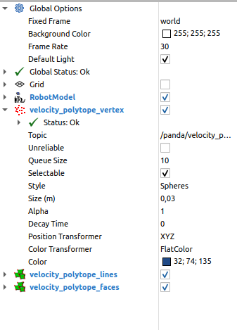
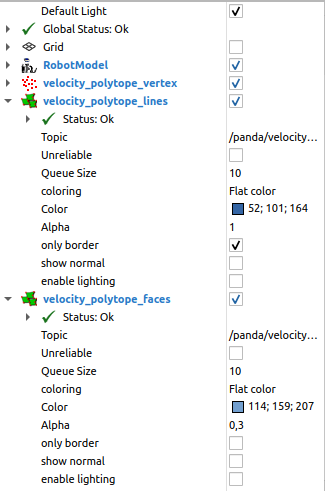
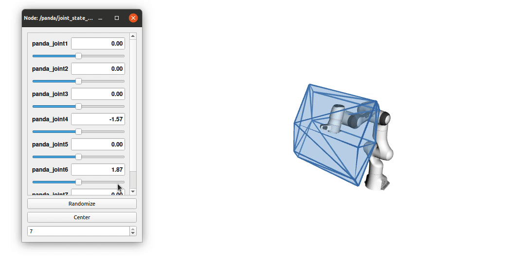

ROS example using ``pinocchio``
===============================================

This is an example of using ``pycapacity`` with ``pinocchio`` and ``ROS``. 
The example is based on the ``panda`` robot. 
The robot is loaded from the ``robot_description`` parameter. 
The robot is visualised in ``rviz``.
The polytope is visualised in ``rviz`` as well using ``jsk_rviz_plugins`` package and its message ``PolygonArray``.

Robot model from ``robot_description``
--------------------------------------

Getting the robot model from ``robot_description`` parameter is easy with ``pinocchio``. Just use its build in function ``buildModelFromXML`` and construct the ``RobotWrapper`` class.
Then we can use the ``RobotWrapper`` class to calculate forward kinematics, jacobians, etc.

.. code-block:: python

    #!/usr/bin/env python
    import rospy
    # time evaluation
    import time
    #some math
    import numpy as np

    # joint state message
    from sensor_msgs.msg import JointState

    # URDF parsing an kinematics 
    import pinocchio as pin

    # initial joint positions
    joint_positions = [0,0,0,0,0,0,0]

    # function receiveing the new joint positions
    def callback(data):
        global joint_positions
        joint_positions = np.array(data.position)

    # main function of the class
    def vel_polytope():
        global joint_positions
        rospy.init_node('vel_polytope')

        # loading the root urdf from robot_description parameter
        robot = pin.RobotWrapper(model=pin.buildModelFromXML(rospy.get_param("robot_description")))
        
        # end-effector frame id
        ee_frame_id = robot.model.getFrameId("panda_link8")

        # joint state topic
        rospy.Subscriber('joint_states', JointState, callback, queue_size= 2)

        rate = rospy.Rate(15) #Hz
        while not rospy.is_shutdown():
            if np.sum(joint_positions):
                robot.forwardKinematics(joint_positions)
                print(f"robot's end-effector position: {robot.data.oMf[ee_frame_id].translation}")
            
            rate.sleep()

    # class definition
    if __name__ == '__main__':
        try:
            vel_polytope()
        except rospy.ROSInterruptException:
            pass

Calculating the polytope using ``pycapacity``
---------------------------------------------

The polytope is calculated using ``pycapacity`` package. To do so we need to calculate the jacobian matrix of the robot as well as the maximal joint velocities.
The maximal joint velocities are taken from the robot model. The jacobian matrix is calculated using ``pinocchio``.

.. code-block:: python

    #!/usr/bin/env python
    import rospy
    # time evaluation
    import time
    #some math
    import numpy as np

    # joint state message
    from sensor_msgs.msg import JointState

    # URDF parsing an kinematics 
    import pinocchio as pin

    # import pycapacity robot
    from pycapacity.robot import *

    # initial joint positions
    joint_positions = [0,0,0,0,0,0,0]

    # function receiveing the new joint positions
    def callback(data):
        global joint_positions
        joint_positions = np.array(data.position)

    def plot_polytope(robot, q, frame_name = None, scaling_factor = 10):

        # if no joint state received, return
        if not np.sum(q):
            return
        
        # if frame not specified, use the last frame
        if frame_name is None:
            frame_name = robot.model.frames[-1].name
        
        # calculate forward kinematics of the robot
        robot.forwardKinematics(q)
        ee_position = robot.data.oMf[robot.model.getFrameId(frame_name)].translation

        # calculate jacobi matrix
        robot.computeJointJacobians(q)
        J = pin.getFrameJacobian(robot.model, robot.data, robot.model.getFrameId(frame_name) , pin.ReferenceFrame.LOCAL_WORLD_ALIGNED)
        # only position part
        J = J[:3,:]

        # maximal joint angles
        dq_max = robot.model.velocityLimit.T
        dq_min = -dq_max

        # calculate force vertexes
        start = time.time()
        poly = velocity_polytope(J, dq_max, dq_min)
        poly.find_faces()
        velocity_vertex, velocity_faces = poly.vertices, poly.faces

        # print time and number of vertices
        print("Time to calculate polytope: ", time.time() - start)
        print("Number of vertices: ", velocity_vertex.shape[1])

    # main function of the class
    def vel_polytope():
        global joint_positions
        rospy.init_node('vel_polytope')

        # loading the root urdf from robot_description parameter
        robot = pin.RobotWrapper(model=pin.buildModelFromXML(rospy.get_param("robot_description")))

        # joint state topic
        rospy.Subscriber('joint_states', JointState, callback, queue_size= 2)

        rate = rospy.Rate(15) #Hz
        while not rospy.is_shutdown():
            plot_polytope(robot, joint_positions, frame_name="panda_link8")
            rate.sleep()

    # class definition
    if __name__ == '__main__':
        try:
            vel_polytope()
        except rospy.ROSInterruptException:
            pass

Adding polytope visualisation using ``jsk_rviz_plugins``
--------------------------------------------------------

The polytope is visualised in ``rviz`` as well using ``jsk_rviz_plugins`` package and its message ``PolygonArray``. The message contains the vertices of the polytope as well as the faces.

To install ``jsk_rviz_plugins`` package, follow the instructions on the `jsk-ros-pkg <https://jsk-visualization.readthedocs.io/en/latest/>`_ website.

.. code-block:: shell

    sudo apt install ros-*-jsk-rviz-plugins # melodic/kinetic... your ros version

Two utility functions are defined to create the vertex and faces messages.

.. code-block:: python

    # polytope messages
    from sensor_msgs.msg import JointState, PointCloud 
    from jsk_recognition_msgs.msg import PolygonArray
    from geometry_msgs.msg import Polygon, Point32, PolygonStamped
    from std_msgs.msg import Header

    # visualisation of vertices
    def create_vertex_msg(force_vertex, pose, frame, scaling_factor = 500):
        pointcloud_massage = PointCloud()
        for i in range(force_vertex.shape[1]):
            point = Point32()
            point.x = force_vertex[0,i]/scaling_factor + pose[0]
            point.y = force_vertex[1,i]/scaling_factor + pose[1]
            point.z = force_vertex[2,i]/scaling_factor + pose[2]
            pointcloud_massage.points.append(point)
        
        # polytop stamped message
        pointcloud_massage.header = Header()
        pointcloud_massage.header.frame_id = frame
        pointcloud_massage.header.stamp = rospy.Time.now()
        return pointcloud_massage

    # visualisation of polytope faces
    def create_polytopes_msg(force_polytopes, pose, frame, scaling_factor = 500):
        polygonarray_message = PolygonArray()
        polygonarray_message.header = Header()
        polygonarray_message.header.frame_id = frame
        polygonarray_message.header.stamp = rospy.Time.now()
        for face_polygon in force_polytopes:
            polygon_massage = Polygon()
            for i in range(face_polygon.shape[1]):
                point = Point32()
                point.x = face_polygon[0,i]/scaling_factor + pose[0]
                point.y = face_polygon[1,i]/scaling_factor + pose[1]
                point.z = face_polygon[2,i]/scaling_factor + pose[2]
                polygon_massage.points.append(point)

            # polytope stamped message
            polygon_stamped = PolygonStamped()
            polygon_stamped.polygon = polygon_massage
            polygon_stamped.header = Header()
            polygon_stamped.header.frame_id = frame
            polygon_stamped.header.stamp = rospy.Time.now()
            polygonarray_message.polygons.append(polygon_stamped)
            polygonarray_message.likelihood.append(1.0)
        return polygonarray_message

Once you have the message, you can add the ``jsk_rviz_plugins`` plugin to ``rviz`` and subscribe to the topic. The result is shown in the figure below.

    Configuration of the display of polytope vertices in ``rviz``.

    Configuration of the display of polytope  faces in ``rviz`` using ``jsk_rviz_plugins`` package ``PolygonArray`` message. We suggest using separate visualisation for faces and edges

Full code of the ROS node
-------------------------

The full code of the ROS node is shown below.

.. code-block:: python

    #!/usr/bin/env python
    import rospy
    # time evaluation
    import time
    #some math
    import numpy as np

    # URDF parsing an kinematics 
    import pinocchio as pin

    # import pycapacity robot
    from pycapacity.robot import *

    # polytope messages
    from sensor_msgs.msg import JointState, PointCloud 
    from jsk_recognition_msgs.msg import PolygonArray
    from geometry_msgs.msg import Polygon, Point32, PolygonStamped
    from std_msgs.msg import Header

    # visualisation of vertices
    def create_vertex_msg(force_vertex, pose, frame, scaling_factor = 500):
        pointcloud_massage = PointCloud()
        for i in range(force_vertex.shape[1]):
            point = Point32()
            point.x = force_vertex[0,i]/scaling_factor + pose[0]
            point.y = force_vertex[1,i]/scaling_factor + pose[1]
            point.z = force_vertex[2,i]/scaling_factor + pose[2]
            pointcloud_massage.points.append(point)
        
        # polytop stamped message
        pointcloud_massage.header = Header()
        pointcloud_massage.header.frame_id = frame
        pointcloud_massage.header.stamp = rospy.Time.now()
        return pointcloud_massage

    # visualisation of polytope faces
    def create_polytopes_msg(force_polytopes, pose, frame, scaling_factor = 500):
        polygonarray_message = PolygonArray()
        polygonarray_message.header = Header()
        polygonarray_message.header.frame_id = frame
        polygonarray_message.header.stamp = rospy.Time.now()
        for face_polygon in force_polytopes:
            polygon_massage = Polygon()
            for i in range(face_polygon.shape[1]):
                point = Point32()
                point.x = face_polygon[0,i]/scaling_factor + pose[0]
                point.y = face_polygon[1,i]/scaling_factor + pose[1]
                point.z = face_polygon[2,i]/scaling_factor + pose[2]
                polygon_massage.points.append(point)

            # polytope stamped message
            polygon_stamped = PolygonStamped()
            polygon_stamped.polygon = polygon_massage
            polygon_stamped.header = Header()
            polygon_stamped.header.frame_id = frame
            polygon_stamped.header.stamp = rospy.Time.now()
            polygonarray_message.polygons.append(polygon_stamped)
            polygonarray_message.likelihood.append(1.0)
        return polygonarray_message

    # initial joint positions
    joint_positions = [0,0,0,0,0,0,0]

    # function receiveing the new joint positions
    def callback(data):
        global joint_positions
        joint_positions = np.array(data.position)

    def plot_polytope(robot, q, frame_name = None, scaling_factor = 10):

        # if no joint state received, return
        if not np.sum(q):
            return
        
        # if frame not specified, use the last frame
        if frame_name is None:
            frame_name = robot.model.frames[-1].name
        
        # calculate forward kinematics of the robot
        robot.forwardKinematics(q)
        ee_position = robot.data.oMf[robot.model.getFrameId(frame_name)].translation

        # calculate jacobi matrix
        robot.computeJointJacobians(q)
        J = pin.getFrameJacobian(robot.model, robot.data, robot.model.getFrameId(frame_name) , pin.ReferenceFrame.LOCAL_WORLD_ALIGNED)
        # only position part
        J = J[:3,:]

        # maximal joint angles
        dq_max = robot.model.velocityLimit.T
        dq_min = -dq_max

        # calculate force vertexes
        start = time.time()
        poly = velocity_polytope(J, dq_max, dq_min)
        poly.find_faces()
        velocity_vertex, velocity_faces = poly.vertices, poly.faces
        print(time.time() - start)

        # publish vertices
        publish_polytope_vertex = rospy.Publisher('velocity_polytope_vertex', PointCloud, queue_size=10)
        publish_polytope_vertex.publish(create_vertex_msg(velocity_vertex, ee_position, "world", scaling_factor))

        # publish plytope
        publish_polytope = rospy.Publisher('velocity_polytope', PolygonArray, queue_size=10)
        publish_polytope.publish(create_polytopes_msg(velocity_faces, ee_position, "world", scaling_factor))
        

    # main function of the class
    def vel_polytope():
        global joint_positions
        rospy.init_node('vel_polytope')

        # loading the root urdf from robot_description parameter
        robot = pin.RobotWrapper(model=pin.buildModelFromXML(rospy.get_param("robot_description")))
        
        # joint state topic
        rospy.Subscriber('joint_states', JointState, callback, queue_size= 2)

        rate = rospy.Rate(15) #Hz
        while not rospy.is_shutdown():
            plot_polytope(robot, joint_positions, frame_name="panda_link8")
            rate.sleep()

    # class definition
    if __name__ == '__main__':
        try:
            vel_polytope()
        except rospy.ROSInterruptException:
            pass

    Interactive visualisation of the polytope in ``rviz`` using ``jsk_rviz_plugins`` package.