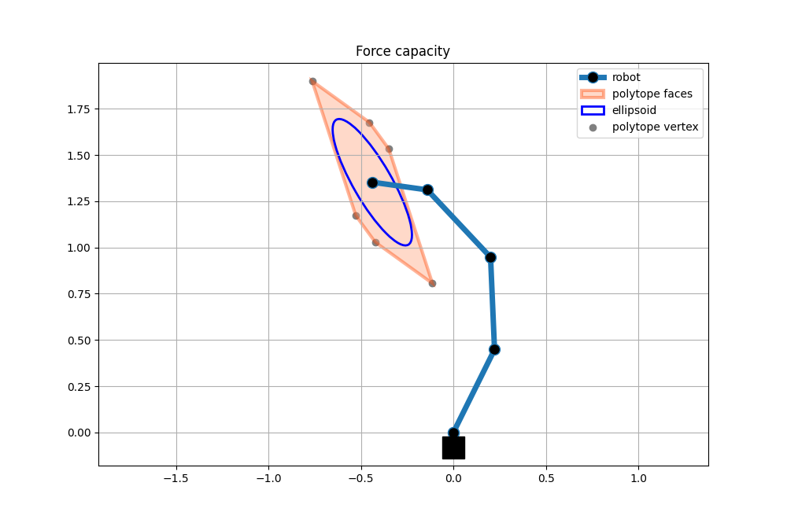

Four link planar robot examples
===============================

Four link planar robot is one very common simplified robot model for different analysis and algorithm development. 
It is composed of 4 links and 4 joints. 
In order to facilitate testing with this simple robot model it is implemented within `pycapacity` package, inside the module `examples` withing the class `FourLinkRobot`, see the module for [more info](../pycapacity.examples.html)


## Force capacity polytope

Force polytope and ellipsoid for 4dof planar robot with random joint angles. The robot, polytope and ellipsoid are visualised using matplotlib.

```python
import numpy as np
import matplotlib.pyplot as plt

from pycapacity.robot import * # robot capacity module
from pycapacity.visual import * # visualistion tools

# four link robot import
from pycapacity.examples import FourLinkRobot

# create the robot
robot = FourLinkRobot()

# joint positions q
q  = np.random.rand(4)*np.pi/3*2-1
# joint torque limits tau
tau_min = -np.ones((4,1))
tau_max = np.ones((4,1))

# jacobian
J = robot.jacobian(q)
# calculate the force polytope
f_poly = force_polytope(J,tau_min,tau_max)

# calculate the force ellipsoid
f_ellipsoid = force_ellipsoid(J, tau_max)

# visualise polytope ellipsoid
fig = plt.figure(12, figsize=[10,10])
scale = 1/5

# plot the robot
robot_position = robot.forward_kinematics(q) 
robot.plot(plt, q)

# plot the polytope
plot_polytope(plot=plt,
              polytope=f_poly,
              center=robot_position, 
              face_color='lightsalmon', 
              edge_color='orangered',
              vertex_color='gray',
              label='polytope', 
              scale=scale)

# plot ellipsoid
plot_ellipsoid(ellipsoid=f_ellipsoid, 
               center=robot_position, 
               plot=plt, 
               label='ellipsoid', 
               edge_color='blue', 
               alpha=1.0,
               scale=scale)
plt.title('Force capacity')
plt.grid()
plt.axis('equal')
plt.legend()
plt.show()
```



## Acceleration capacity polytope

Acceleration polytope and ellipsoid for 4dof planar robot with random joint angles. The robot, polytope and ellipsoid are visualised using matplotlib.

```python
import numpy as np
import matplotlib.pyplot as plt

from pycapacity.robot import * # robot capacity module
from pycapacity.visual import * # visualistion tools

# four link robot import
from pycapacity.examples import FourLinkRobot

# create the robot
robot = FourLinkRobot()


# joint positions q
q  = np.random.rand(4)*np.pi/2
# joint torque limits tau
tau_min = -np.ones((4,1))
tau_max = np.ones((4,1))


# jacobian
J = robot.jacobian(q)
# jacobian
M = robot.inertia(q)

# calculate the velocity polytope
a_poly = acceleration_polytope(J, M, tau_min ,tau_max)

# calculate the velocity ellipsoid
a_ellipsoid = acceleration_ellipsoid(J, M, tau_max)


# visualise polytope ellipsoid
fig = plt.figure(13, figsize=[10,10])
scale = 1/50


# plot the robot
robot_position = robot.forward_kinematics(q) 
robot.plot(plt, q)

# plot the polytope
plot_polytope(plot=plt,
              polytope=a_poly,
              center=robot_position, 
              face_color='lightsalmon', 
              edge_color='orangered',
              vertex_color='gray',
              label='polytope', 
              scale=scale)

# plot ellipsoid
plot_ellipsoid(ellipsoid=a_ellipsoid, 
               center=robot_position, 
               plot=plt, 
               label='ellipsoid', 
               edge_color='blue', 
               alpha=1.0,
               scale=scale)

plt.title("Acceleration capacity")
plt.grid()
plt.axis('equal')
plt.legend()
plt.show()
```


## Velocity capacity polytope

Velocity polytope and ellipsoid for 4dof planar robot with random joint angles. The robot, polytope and ellipsoid are visualised using matplotlib.

```python
import numpy as np
import matplotlib.pyplot as plt

from pycapacity.robot import * # robot capacity module
from pycapacity.visual import * # visualistion tools

# four link robot import
from pycapacity.examples import FourLinkRobot

# create the robot
robot = FourLinkRobot()

#joint positions q
q  = np.random.rand(4)*np.pi/3*2-1
# joint torque limits tau
dq_min = -np.ones((4,1))
dq_max = np.ones((4,1))

# jacobian
J = robot.jacobian(q)
# calculate the velocity polytope
v_poly = velocity_polytope(J, dq_min ,dq_max)

# calculate the velocity ellipsoid
v_ellipsoid = velocity_ellipsoid(J, dq_max)

# visualise polytope ellipsoid
fig = plt.figure(14, figsize=[10,10])
scale = 1/5

# plot the robot
robot_position = robot.forward_kinematics(q) 
robot.plot(plt, q)

# plot the polytope
plot_polytope(plot=plt,
              polytope=v_poly,
              center=robot_position, 
              face_color='lightsalmon', 
              edge_color='orangered',
              vertex_color='gray',
              label='polytope', 
              scale=scale)

# plot ellipsoid
plot_ellipsoid(ellipsoid=v_ellipsoid, 
               center=robot_position, 
               plot=plt, 
               label='ellipsoid', 
               edge_color='blue', 
               alpha=1.0,
               scale=scale)

plt.title("Velocity capacity")
plt.grid()
plt.axis('equal')
plt.legend()
plt.show()
```
