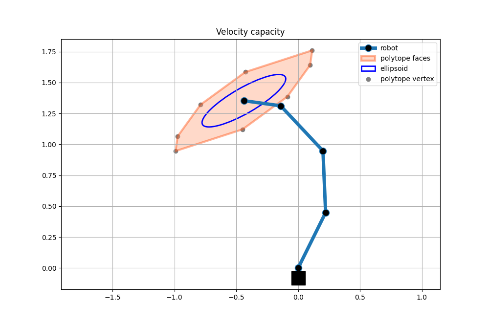

Four link planar robot examples
==================

Four link planar robot is one very common simplified robot model for different analysis and algorithm development. It is composed of 4 links and 4 joints. 

To run the following examples copy these functions in a file `four_link_utils.py`.
```python
"""
Four link planar robot example
- Direct kinematics and jacobian matrix calacualiton for the simple 4 dof plananr robot
- n=4 and m=2
"""
import numpy as np

# jacobian function for four link planar robot
def four_link_jacobian(joints):
    sq1 = np.sin(joints[0])
    sq12 = np.sin(joints[0] + joints[1])
    sq123 = np.sin(joints[0] + joints[1] + joints[2])
    sq1234 = np.sin(joints[0] + joints[1] + joints[2] + joints[3])
    cq1 = np.cos(joints[0])
    cq12 = np.cos(joints[0] + joints[1])
    cq123 = np.cos(joints[0] + joints[1] + joints[2])
    cq1234 = np.cos(joints[0] + joints[1] + joints[2] + joints[3])
    return np.array([[0.5*cq1+0.5*cq12+0.5*cq123+0.3*cq1234, 0.5*cq12+0.5*cq123+0.3*cq1234, 0.5*cq123+0.7*cq1234, +0.3*cq1234], [-0.5*sq1-0.5*sq12-0.5*sq123-0.3*sq1234, -0.5*sq12-0.5*sq123-0.3*sq1234, -0.5*sq123-0.3*sq1234, -0.3*sq1234]])

# inertia matrix of a four link planar robot
def four_link_inertia(joints):
    sq1 = np.sin(joints[1])
    cq1 = np.cos(joints[1])
    sq2 = np.sin(joints[2])
    cq2 = np.cos(joints[2])
    sq3 = np.sin(joints[3])
    cq3 = np.cos(joints[3])
    return np.reshape([cq1*(5.0/8.0)+cq2*(3.0/8.0)+cq3/8.0+cq1*cq2*(3.0/8.0)+(cq2*cq3)/8.0-sq1*sq2*(3.0/8.0)-(sq2*sq3)/8.0+(cq1*cq2*cq3)/8.0-(cq1*sq2*sq3)/8.0-(cq2*sq1*sq3)/8.0-(cq3*sq1*sq2)/8.0+7.0/8.0,cq1*(5.0/1.6e+1)+cq2*(3.0/8.0)+cq3/8.0+cq1*cq2*(3.0/1.6e+1)+(cq2*cq3)/8.0-sq1*sq2*(3.0/1.6e+1)-(sq2*sq3)/8.0+(cq1*cq2*cq3)/1.6e+1-(cq1*sq2*sq3)/1.6e+1-(cq2*sq1*sq3)/1.6e+1-(cq3*sq1*sq2)/1.6e+1+1.5e+1/3.2e+1,cq2*(3.0/1.6e+1)+cq3/8.0+cq1*cq2*(3.0/1.6e+1)+(cq2*cq3)/1.6e+1-sq1*sq2*(3.0/1.6e+1)-(sq2*sq3)/1.6e+1+(cq1*cq2*cq3)/1.6e+1-(cq1*sq2*sq3)/1.6e+1-(cq2*sq1*sq3)/1.6e+1-(cq3*sq1*sq2)/1.6e+1+3.0/1.6e+1,cq3/1.6e+1+(cq2*cq3)/1.6e+1-(sq2*sq3)/1.6e+1+(cq1*cq2*cq3)/1.6e+1-(cq1*sq2*sq3)/1.6e+1-(cq2*sq1*sq3)/1.6e+1-(cq3*sq1*sq2)/1.6e+1+1.0/3.2e+1,cq1*(5.0/1.6e+1)+cq2*(3.0/8.0)+cq3/8.0+cq1*cq2*(3.0/1.6e+1)+(cq2*cq3)/8.0-sq1*sq2*(3.0/1.6e+1)-(sq2*sq3)/8.0+(cq1*cq2*cq3)/1.6e+1-(cq1*sq2*sq3)/1.6e+1-(cq2*sq1*sq3)/1.6e+1-(cq3*sq1*sq2)/1.6e+1+1.5e+1/3.2e+1,cq2*(3.0/8.0)+cq3/8.0+(cq2*cq3)/8.0-(sq2*sq3)/8.0+1.5e+1/3.2e+1,cq2*(3.0/1.6e+1)+cq3/8.0+(cq2*cq3)/1.6e+1-(sq2*sq3)/1.6e+1+3.0/1.6e+1,cq3/1.6e+1+(cq2*cq3)/1.6e+1-(sq2*sq3)/1.6e+1+1.0/3.2e+1,cq2*(3.0/1.6e+1)+cq3/8.0+cq1*cq2*(3.0/1.6e+1)+(cq2*cq3)/1.6e+1-sq1*sq2*(3.0/1.6e+1)-(sq2*sq3)/1.6e+1+(cq1*cq2*cq3)/1.6e+1-(cq1*sq2*sq3)/1.6e+1-(cq2*sq1*sq3)/1.6e+1-(cq3*sq1*sq2)/1.6e+1+3.0/1.6e+1,cq2*(3.0/1.6e+1)+cq3/8.0+(cq2*cq3)/1.6e+1-(sq2*sq3)/1.6e+1+3.0/1.6e+1,cq3/8.0+3.0/1.6e+1,cq3/1.6e+1+1.0/3.2e+1,cq3/1.6e+1+(cq2*cq3)/1.6e+1-(sq2*sq3)/1.6e+1+(cq1*cq2*cq3)/1.6e+1-(cq1*sq2*sq3)/1.6e+1-(cq2*sq1*sq3)/1.6e+1-(cq3*sq1*sq2)/1.6e+1+1.0/3.2e+1,cq3/1.6e+1+(cq2*cq3)/1.6e+1-(sq2*sq3)/1.6e+1+1.0/3.2e+1,cq3/1.6e+1+1.0/3.2e+1,1.0/3.2e+1],[4,4]);

# joint posiaions in cartesian space given the configuaiton
def four_link_robot_plot(joints):
    L = [0, 0.5,0.5,0.5,0.3] # link lengths
    x = np.zeros((2,1))
    for i in range(5):
        sq = np.sum(joints[:i])
        x = np.hstack((x, x[:,-1].reshape(2,1)+ L[i]*np.array([[np.sin(sq)], [np.cos(sq)]])))
    return x
```

Once you've done so you can run the following examples and calculate different capacity metrics for you 4dof planar robot.

## Force capacity polytope

Force polytope and ellipsoid for 4dof planar robot with random joint angles. The robot, polytope and ellipsoid are visualised using matplotlib.

```python
import numpy as np
import matplotlib.pyplot as plt

import pycapacity.robot as capacity # robot capacity module
import pycapacity.visual as visual # visualistion tools

from four_link_utils import four_link_jacobian, four_link_robot_plot 

# joint positions q
q  = np.random.rand(4)*np.pi/3*2-1
# joint torque limits tau
tau_min = -np.ones((4,1))
tau_max = np.ones((4,1))

# find robot position
# a bit of scaling
robot_position = four_link_robot_plot(q)*5 

# jacobian
J = four_link_jacobian(q)
# calculate the velocity polytope
f_vert, faces_indices = capacity.force_polytope_withfaces(J,tau_min,tau_max)
faces = capacity.face_index_to_vertex(f_vert, faces_indices)

# calculate the velocity ellipsoid
S,U = capacity.force_ellipsoid(J, tau_max)

# visualise polytope ellispoid
fig = plt.figure(12)
ax = fig.gca()
#plot the robot
plt.plot(robot_position[0,:],robot_position[1,:],linewidth=5, label="robot")
plt.plot(robot_position[0,:],robot_position[1,:],'ko',linewidth=5)
#plot the polytope
visual.plot_polytope_faces(ax=ax,faces=faces,center=robot_position[:,-1], face_color='lightsalmon', edge_color='orangered',label='polytope')
visual.plot_polytope_vertex(ax=ax,vertex=f_vert,center=robot_position[:,-1], color='gray')
# plot ellispoid
visual.plot_ellipsoid(S, U, center=robot_position[:,-1], ax=ax, label='ellipsoid', color=None, edge_color='blue', alpha=1.0)

plt.title("Force capacity")
plt.grid()
plt.axis('equal')
plt.legend()
plt.show()
```


## Acceleration capacity polytope

Acceleration polytope and ellipsoid for 4dof planar robot with random joint angles. The robot, polytope and ellipsoid are visualised using matplotlib.
```python
import numpy as np
import matplotlib.pyplot as plt

import pycapacity.robot as capacity # robot capacity module
import pycapacity.visual as visual # visualistion tools

from four_link_utils import four_link_inertia, four_link_jacobian, four_link_robot_plot 

#joint positions q
q  = np.random.rand(4)*np.pi/2
# joint torque limits tau
tau_min = -np.ones((4,1))
tau_max = np.ones((4,1))

# find robot position
# a bit of scaling
robot_position = four_link_robot_plot(q)*50 

# jacobian
J = four_link_jacobian(q)
# jacobian
M = four_link_inertia(q)
# calculate the acceleration polytope
acc_vert, faces_indices = capacity.acceleration_polytope_withfaces(J, M, tau_min ,tau_max)
faces = capacity.face_index_to_vertex(acc_vert, faces_indices)

# calculate the acceleration ellipsoid
S,U = capacity.acceleration_ellipsoid(J, M, tau_max)


# visualise polytope ellispoid
fig = plt.figure(13)
ax = plt.gca()

#plot the robot
plt.plot(robot_position[0,:],robot_position[1,:],linewidth=5, label="robot")
plt.plot(robot_position[0,:],robot_position[1,:],'ko',linewidth=5)
#plot the polytope
visual.plot_polytope_faces(ax=plt,faces=faces, center=robot_position[:,-1], face_color='lightsalmon', edge_color='orangered',label='polytope')
visual.plot_polytope_vertex(ax=ax,vertex=acc_vert, center=robot_position[:,-1],color='gray')
# plot ellispoid
visual.plot_ellipsoid(S, U, center=robot_position[:,-1], ax=ax, label='ellipsoid', color=None, edge_color='blue', alpha=1.0)

plt.title("Acceleration capacity")
plt.grid()
plt.legend()
plt.show()
```


## Velocity capacity polytope

Acceleration polytope and ellipsoid for 4dof planar robot with random joint angles. The robot, polytope and ellipsoid are visualised using matplotlib.
```python
import numpy as np
import matplotlib.pyplot as plt

import pycapacity.robot as capacity # robot capacity module
import pycapacity.visual as visual # visualistion tools

from four_link_utils import four_link_jacobian, four_link_robot_plot 

#joint positions q
q  = np.random.rand(4)*np.pi/3*2-1
# joint torque limits tau
dq_min = -np.ones((4,1))
dq_max = np.ones((4,1))

# find robot position
# a bit of scaling
robot_position = four_link_robot_plot(q)*5

# jacobian
J = four_link_jacobian(q)
# calculate the force polytope
vel_vert, faces_indices = capacity.velocity_polytope_withfaces(J, dq_min ,dq_max)
faces = capacity.face_index_to_vertex(vel_vert, faces_indices)

# calculate the force ellipsoid
S,U = capacity.velocity_ellipsoid(J, dq_max)


# visualise polytope ellipsoid
fig = plt.figure(14)
ax = plt.gca()

#plot the robot
plt.plot(robot_position[0,:],robot_position[1,:],linewidth=5, label="robot")
plt.plot(robot_position[0,:],robot_position[1,:],'ko',linewidth=5)
#plot the polytope
visual.plot_polytope_faces(ax=plt,faces=faces,center=robot_position[:,-1],face_color='lightsalmon', edge_color='orangered',label='polytope')
visual.plot_polytope_vertex(ax=ax,vertex=vel_vert,center=robot_position[:,-1],color='gray')
# plot the ellipsoid
visual.plot_ellipsoid(S, U, center=robot_position[:,-1], ax=ax, label='ellipsoid', color=None, edge_color='blue', alpha=1.0)

plt.title("Velocity capacity")
plt.grid()
plt.legend()
plt.show()
```
