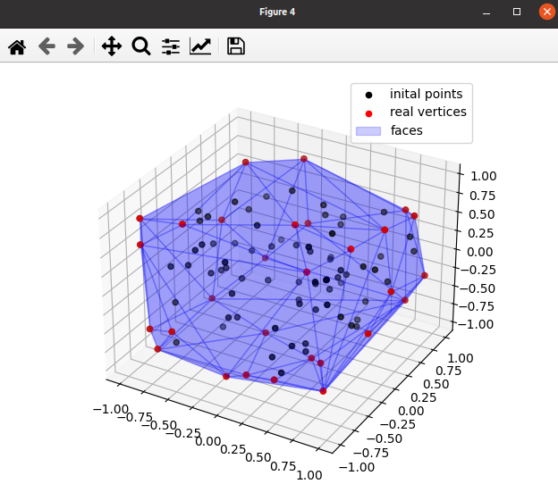

Find a half-plane representation of a set of vertices
=====================================================

A simple example program for find a half-plane representation of a set of vertices

.. code-block:: python
    
    import pycapacity.algorithms as algos # algos module
    import numpy as np

    N = 100 # hundred vertices
    m = 3   # space dimension

    points = np.array(np.random.rand(m,N))*2-1 # random jacobian matrix

    # find half-plane representaiton Ax <= b
    A, b = algos.vertex_to_hspace(points)
    print('A: \n',A, '\nb: \n',b)

    # check if zero is inside the polytope
    print('Zero is inside: ',np.all(A@np.zeros(m) <= b))

The output of this code is something similar to this:

.. code-block:: shell

    A: 
    [[ 4.28104029e-01 -8.31204261e-01 -3.54720195e-01]
    .....
    [-9.68921041e-01 -2.31204575e-01  8.79571563e-02]] 
    b: 
    [1.10637503 0.98370877 0.97940547 0.99545632 0.99011297 0.93456775
    ....
    0.90698497 0.90077881 1.04799771 0.96400478]
    Zero is inside: True

.. code-block:: python

    # isualise the polytope found 
    # face indices to faces
    verts_real, face_indices = algos.hspace_to_vertex(A,b)
    faces = algos.face_index_to_vertex(verts_real, face_indices)

    # plotting the polytope
    import matplotlib.pyplot as plt
    from pycapacity.visual import plot_polytope_faces, plot_polytope_vertex # pycapacity visualisation tools
    fig = plt.figure(4)

    # draw faces and vertices
    ax = plot_polytope_vertex(plt=plt, vertex=points, label='inital points',color='black')
    plot_polytope_vertex(ax=ax, vertex=verts_real, label='real vertices',color='red')
    plot_polytope_faces(ax=ax, faces=faces, face_color='blue', edge_color='blue', label='faces', alpha=0.2)

    plt.tight_layout()
    plt.legend()
    plt.show()

The output of this program will be an image of visualised all the inital points in black, the real vertices (convex hull) in red as well as the found faces described by the inequalities :math:`Àx\leq b`

