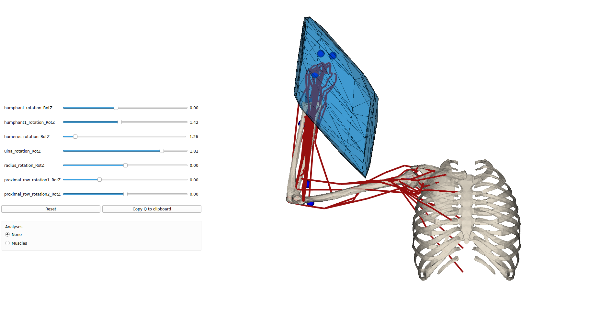

# Pyomeca examples

<p>
</p>

A colleciton of simple examples codes for simpler starting with  [pyomeca](https://github.com/pyomeca) solftware, particularly wiht [biorbd](https://github.com/pyomeca/biorbd) and [bioviz](https://github.com/pyomeca/bioviz)


## Installing Pyomeca biorbd and bioviz

the best way to download and install the pyomeca biordb and bioviz libraries is to use anaconda.

For anaconda install you can simply download the yaml file and save it as `env.yaml`:
```yaml
name: pyomeca
channels:
  - conda-forge
  - default
dependencies:
  - python=3.9
  - bioviz
  - biorbd
  - jupyter
  - pip 
  - pip:
    - pycapacity
```
And create a new ready to go environment:
```
conda env create -f env.yaml    # create the new environemnt and install biorbd,bioviz 
conda actiavte pyomeca
```

#### Creating the custom environment from scratch
You can also simply use anaconda to create a new custom environment:
```bash
conda create -n pyomeca python=3 # create python 3 based environment
conda activate pyomeca           # activate the environment 
conda install biorbd bioviz      # install biorbd and bioviz
```

Then install `pycapacity` for the workspace analysis
```bash
pip install pycapacity
```

## Downloading musculoskeletal models
you can use any pyomeca `.bioMod` model, however to jump-start the development we suggest you to download our small database of models at the [link](https://gitlab.inria.fr/auctus-team/components/modelisation/humanmodels/pyomeca_models)

You can download it using terminal:
```
git clone git@gitlab.inria.fr:auctus-team/components/modelisation/humanmodels/pyomeca_models.git
```
Or downloading the zip from the link [https://gitlab.inria.fr/auctus-team/components/modelisation/humanmodels/pyomeca_models](https://gitlab.inria.fr/auctus-team/components/modelisation/humanmodels/pyomeca_models)

Make sure to place the `pyomeca_models` folder in the directory that will contain your python code.
## Visualise models code example
A simple example of a python code visualising the mucsuloskeletal models. by launching this code you should be able to make sure that your installation works well.
```python
import bioviz
import biorbd
import numpy as np

# Load a predefined model
# model = biorbd.Model("pyomeca_models/MOBL_ARMS_fixed_33.bioMod")
# model = biorbd.Model("pyomeca_models/BrasComplet.bioMod")
# model = biorbd.Model("pyomeca_models/BrasViolon.bioMod")
# model = biorbd.Model("pyomeca_models/arm26.bioMod")
model = biorbd.Model("pyomeca_models/BrasCompletIMUS.bioMod")

# get some random data
nq = model.nbQ()
nb_mus = model.nbMuscles()
print("dof number: ",nq)
print("muscle number: ",nb_mus)


# a bit of animation
q_recons = np.zeros((model.nbQ(), 100))
for i in range(1,100):
    # increment all joint values by -0.003
    q_recons[:, i] = q_recons[:, i-1]-0.003 

# double duration of the animation
q_recons = np.hstack((q_recons,np.flip(q_recons)))

# visualize
b = bioviz.Viz(loaded_model=model)
# b.load_movement(q_recons)
b.exec()
```


## Interactive force polytope code example
A simple example of a python code visualising the mucsuloskeletal models. by launching this code you should be able to make sure that your installation works well.

```python
import numpy as np
import biorbd
import bioviz
from bioviz.biorbd_vtk import VtkModel, VtkWindow, Mesh

# a bit of statistics
import time

# polytope algorithm
from pycapacity.human import force_polytope
from pycapacity.human import torque_to_muscle_force

# Load a predefined model
model = biorbd.Model("pyomeca_models/MOBL_ARMS_fixed_33.bioMod")
# model = biorbd.Model("pyomeca_models/BrasComplet.bioMod")

# get the number of dof and muslces
nq = model.nbQ()
nb_mus = model.nbMuscles()

# Animate the results if biorbd viz is installed
b = bioviz.Viz(loaded_model=model,background_color=(1,1,1),show_local_ref_frame=False, show_global_ref_frame=False, show_markers=True,show_global_center_of_mass=False,show_segments_center_of_mass=False, show_wrappings=False)
# define the meshes for the polytope - without robot
vtkMeshView = VtkModel(b.vtk_window, patch_color=[[0,0.5,0.8]],mesh_opacity=0.5)
vtkMeshView1 = VtkModel(b.vtk_window, patch_color=[[0,0.5,0.8]],mesh_opacity=0.8, force_wireframe=True)

b.set_q([0.0,1.4237,-1.256,1.8218,0.0,0.0,0.0])
while b.vtk_window.is_active:
    Q = b.Q
    model.updateMuscles(Q, True)
    model.UpdateKinematicsCustom(Q, np.zeros(nq), np.zeros(nq))

    F_max = []
    F_min = []
    for i in range(nb_mus):
        F_max.append(model.muscle(i).characteristics().forceIsoMax())
        #F_min.append(0)
        a = biorbd.HillThelenType(model.muscle(i)).FlPE()
        if a > 1:
            a = 0.1
        elif a < 0:
            a = 0
        F_min.append(a*F_max[-1])

    start = time.time()
    N = -model.musclesLengthJacobian(Q).to_array().T
    J = model.markersJacobian(Q, False, False)[-1].to_array()
    print("time", time.time() - start)

    # Proceed with the inverse dynamics
    Tau_grav = model.InverseDynamics(Q, np.zeros(nq), np.zeros(nq))
    
    start = time.time()
    f_vert, H, d, faces = force_polytope(J, N, F_min, F_max, 10, -Tau_grav.to_array())
    print("time", time.time() - start)

    ## display polytope in the bioviz
    f_vert_show = np.vstack((f_vert[0,:],f_vert[1,:],f_vert[2,:]))/2000
    f_vert_show = f_vert_show + model.markers(Q)[model.nbMarkers()-1].to_array().reshape(3,1)
    s = f_vert_show.shape
    vert = f_vert_show.reshape(s[0],s[1],1)

    # plot polytope (blue) - with the robot
    meshes = []
    meshes.append(Mesh(vertex=vert, triangles=faces.T))
    vtkMeshView.update_mesh(meshes)
    vtkMeshView1.update_mesh(meshes)

    # update visualisation
    b.update()

```

