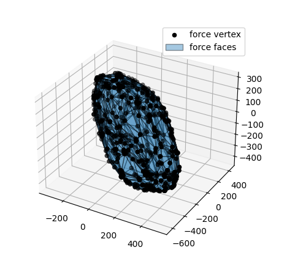

Randomized Human musculoskeletal models
=======================================

A simple example program for force polytope evaluation of a randomised human musculoskeletal model. 
Simply change the number of dof, number of forces and force limits and see how the calculation time and shape evaluates.

```python
import pycapacity.human as capacity # robot capacity module
import numpy as np

L = 20 # number of muscles
m = 3 # 3d forces
n = 6 # number of joints - dof

J = np.array(np.random.rand(m,n))*2-1 # random jacobian matrix
N = np.array(np.random.rand(n,L))*2-1 # random moment arm matrix

F_max = 100*np.ones(L)  # muscle forces limits max and min
F_min = np.zeros(L)

f_poly = capacity.force_polytope(J,N, F_min, F_max, 0.1) # calculate the polytope 

print(f_poly.vertices) # display the vertices


# plotting the polytope
import matplotlib.pyplot as plt
from pycapacity.visual import * # pycapacity visualisation tools
fig = plt.figure(4)

# draw faces and vertices
plot_polytope(plot=plt, 
              polytope=f_poly, 
              label='force', 
              edge_color='black', 
              alpha = 0.4)

plt.legend()
plt.show()

```

