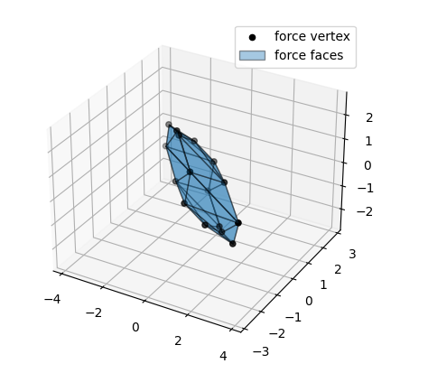

Randomized robot
================

A simple example program for force polytope evaluation of a randomised robot model. 
Simply change the number of dof torque limits and see how the calculation time and shape evaluates.


<div class="admonition-new-examples admonition">
<p class="admonition-title">📢 NEW Examples!</p>
<dl class="simple">
<dt>For some more examples check out the <code class="docutils literal notranslate"><span class="pre">examples</span></code> folder of the repository.</dt><dd><ul class="simple">
<li><p>Interactive jupyter notebooks are available in the <code class="docutils literal notranslate"><span class="pre">examples/notebooks</span></code> folder: <a class="reference external" href="https://github.com/auctus-team/pycapacity/blob/master/examples/notebooks/demo_simple.ipynb">see on Github</a></p></li>
</ul>
</dd>
</dl>
</div>


```python
import pycapacity.robot as capacity # robot capacity module
import numpy as np

m = 3 # 3d forces
n = 6 # robot dof 

# this seed is used to generate the same image 
# as in the examples in the docs 
np.random.seed(12345)

J = np.array(np.random.rand(m,n)) # random jacobian matrix

t_max = np.ones(n)  # joint torque limits max and min
t_min = -np.ones(n)

f_poly = capacity.force_polytope(J,t_min, t_max) # calculate the polytope

print(f_poly.vertices) # display the vertices

# plotting the polytope
import matplotlib.pyplot as plt
from pycapacity.visual import * # pycapacity visualisation tools
fig = plt.figure(4)

# draw faces and vertices
plot_polytope(plot=plt, 
              polytope=f_poly, 
              label='force', 
              edge_color='black', 
              alpha = 0.4)

plt.legend()
plt.show()
```

