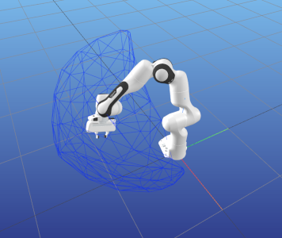
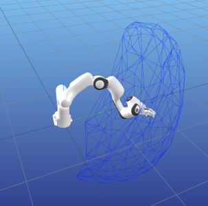

Reachable Space with Pinocchio and CGAL
=======================================


This is an example tutorial of how to setup `pinocchio` and `CGAL` library with `pycapacity` to calculate and visualise the robot capacities


## Installing Pinocchio

Pinocchio library can be downloaded as sa pip package however due to the large number of different dependencies we suggest you to use anaconda.
### Pip package install

Install the `pinocchio` library
```
pip install pin
```
Install an additional library with robot data `example_robot_data` provided by pinocchio community as well [more info](https://github.com/Gepetto/example-robot-data)
```
pip install example-robot-data
```
Install the visualisation library `meshcat` that is compatible with pinocchio simple and powerful visualisaiton library [more info](https://pypi.org/project/meshcat/)
```
pip install meshcat
```

Then install `CGAL` library for the workspace analysis
```bash
pip install cgal
```


Finally install `pycapacity` for the workspace analysis
```bash
pip install pycapacity
```


Also you can install `ipython` of `jupyter` for simplicity.

### Anaconda install

For anaconda instals you can simply download the yaml file and save it as `env.yaml`:
```yaml
name: rwspace
channels:
  - defaults
  - conda-forge
dependencies:
  - python
  - conda-forge::pinocchio
  - conda-forge::gepetto-viewer
  - conda-forge::gepetto-viewer-corba
  - conda-forge::example-robot-data
  - conda-forge::meshcat-python
  - pip:
    - pycapacity
    - cgal
```
And create a new ready to go environment:
```
conda env create -f env.yaml    # create the new environemnt and install pinocchio, gepetto, pycapacity,.. 
conda actvavte rwspace
```

#### Creating the custom environment from scratch
You can also simply use anaconda to create a new custom environment:
```bash
conda create -n rwspace python=3 pip # create python 3.8 based environment
conda activate rwspace
```

Install all the needed packages
```bash
conda install -c conda-forge pinocchio 
conda install -c conda-forge example-robot-data 
conda install -c conda-forge gepetto-viewer
```

Then install `CGAL` library for the workspace analysis
```bash
pip install cgal
```

Then install `pycapacity` for the workspace analysis
```bash
pip install pycapacity
```


## Code example

This example code calculates the reachable space of the panda robot (in a random joint configuration) and visualises it using `meshcat`. 

```python
import pinocchio as pin
import numpy as np
import time
from example_robot_data import load

robot = load('panda')

# Display a robot configuration.
# q0 = pin.neutral(robot.model)
q0 = robot.q0

# calculate the jacobian
data = robot.model.createData()
pin.framesForwardKinematics(robot.model,data,q0)

# set the time-horizon
horizon_time = 0.2 # secs

# create a simple forward kinematics function
# taking the current joint configuration q
# and outputting the end-effector position
def fk(q):
    pin.framesForwardKinematics(robot.model,data,q)
    return data.oMf[robot.model.getFrameId(robot.model.frames[-1].name)].translation

# polytope python module
import pycapacity.robot as pycap
# get max torque
q_max = robot.model.upperPositionLimit.T
q_min = robot.model.lowerPositionLimit.T
# get max velocity
dq_max = robot.model.velocityLimit
dq_min = -dq_max

# set a random joint configuration
q = np.random.uniform(q_min,q_max)

opt = {
  'calculate_faces': True,
  'convex_hull': False, # if True, the reachable space will be approximated with a convex hull of the vertices (does not require CGAL)
  'n_samples':3,     # number of samples per dimension of the facet (the higher the better the approximation - n_samples^facet_dim samples)
  'facet_dim':2        # dimension of the joint-space facet to be sampled (0 for vertices, 1 for edges, 2 for faces, up to n_dof -1, where n_dof is the number of degrees of freedom)
}

# calculate force polytope
rw_poly = pycap.reachable_space_nonlinear(
            forward_func=fk,
            q0=q,
            q_max= q_max, 
            q_min= q_min,
            dq_max= dq_max,
            dq_min= dq_min,
            time_horizon=horizon_time,
            options=opt
    )


## visualise the robot
from pinocchio.visualize import MeshcatVisualizer

viz = MeshcatVisualizer(robot.model, robot.collision_model, robot.visual_model)
# Start a new MeshCat server and client.
viz.initViewer(open=True)
# Load the robot in the viewer.
viz.loadViewerModel()
viz.display(q)
# small time window for loading the model 
# if meshcat does not visualise the robot properly, augment the time
# it can be removed in most cases
time.sleep(0.2) 

## visualise the polytope and the ellipsoid
import meshcat.geometry as g 

# meshcat triangulated mesh
poly = g.TriangularMeshGeometry(vertices=rw_poly.vertices.T, faces=rw_poly.face_indices)
viz.viewer['rwspace'].set_object(poly, g.MeshBasicMaterial(color=0x0022ff, wireframe=True, linewidth=3, opacity=0.2))
```

Here is the visualisation of the reachable space of two different runns of the code:

 


## Animate polytopes in Meshcat

This example code calculates the reachable space of the panda robot for a sinusoidal motion and visualises it using `meshcat`.


```python
import pinocchio as pin
import numpy as np

from example_robot_data import load

# get panda robot usinf example_robot_data
robot = load('panda')

# get joint position ranges
q_max = robot.model.upperPositionLimit.T
q_min = robot.model.lowerPositionLimit.T
# get max velocity
dq_max = robot.model.velocityLimit
dq_min = -dq_max

# Use robot configuration.
q = (q_min+q_max)/2

## visualise the robot
from pinocchio.visualize import MeshcatVisualizer

viz = MeshcatVisualizer(robot.model, robot.collision_model, robot.visual_model)
# Start a new MeshCat server and client.
viz.initViewer(open=True)
# Load the robot in the viewer.
viz.loadViewerModel()
viz.display(q)


import pycapacity.robot as pycap
import meshcat.geometry as g 

# set the time-horizon
horizon_time = 0.2 # secs

# create a simple forward kinematics function
# taking the current joint configuration q
# and outputting the end-effector position
def fk(q):
    pin.framesForwardKinematics(robot.model,data,q)
    return data.oMf[robot.model.getFrameId(robot.model.frames[-1].name)].translation

  opt = {
    'calculate_faces': True,
    'convex_hull': False, # if True, the reachable space will be approximated with a convex hull of the vertices (does not require CGAL)
    'n_samples':2,     # number of samples per dimension of the facet (the higher the better the approximation - n_samples^facet_dim samples)
    'facet_dim':1        # dimension of the joint-space facet to be sampled (0 for vertices, 1 for edges, 2 for faces, up to n_dof -1, where n_dof is the number of degrees of freedom)
  }

while True:
    # some sinusoidal motion
    for i in np.sin(np.linspace(-np.pi,np.pi,200)):

        # update the joint position
        q[0] = i
        q[1] = i
        q[2] = i

        # calculate the jacobian
        data = robot.model.createData()
        
        # calculate force polytope
        rw_poly = pycap.reachable_space_nonlinear(
                    forward_func=fk,
                    q0=q,
                    q_max= q_max, 
                    q_min= q_min,
                    dq_max= dq_max,
                    dq_min= dq_min,
                    time_horizon=horizon_time,
                    options=opt
            )

        # visualise the robot
        viz.display(q)

        
        # meshcat triangulated mesh
        poly = g.TriangularMeshGeometry(vertices=rw_poly.vertices.T, faces=rw_poly.face_indices)
        viz.viewer['rwspace'].set_object(poly, g.MeshBasicMaterial(color=0x0022ff, wireframe=True, linewidth=3, opacity=0.2))

```


<div class="admonition-new-examples admonition">
<p class="admonition-title">📢 NEW Examples!</p>
<dl class="simple">
<dt>For some more examples check out the <code class="docutils literal notranslate"><span class="pre">examples</span></code> folder of the repository.</dt><dd><ul class="simple">
<li><p>Interactive jupyter notebooks are available in the <code class="docutils literal notranslate"><span class="pre">examples/notebooks</span></code> folder: see on Github <a class="reference external" href="https://github.com/auctus-team/pycapacity/blob/master/examples/notebooks/pinocchio.ipynb">velocity polytope</a> and <a class="reference external" href="https://github.com/auctus-team/pycapacity/blob/master/examples/notebooks/pinocchio_reachable_space.ipynb">reachable space polytope</a></p></li> 
<li><p>Python scripts are available in the <code class="docutils literal notranslate"><span class="pre">examples/scripts</span></code> folder: <a class="reference external" href="https://github.com/auctus-team/pycapacity/blob/master/examples/scripts/pinocchio_example.py">see on Github</a></p></li>
</ul>
</dd>
</dl>
</div>
