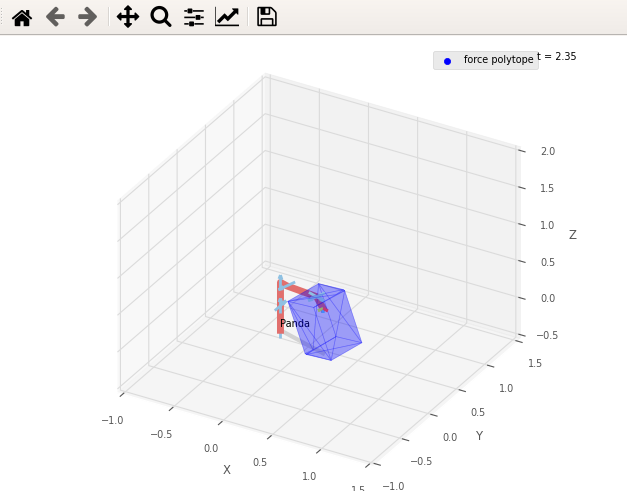
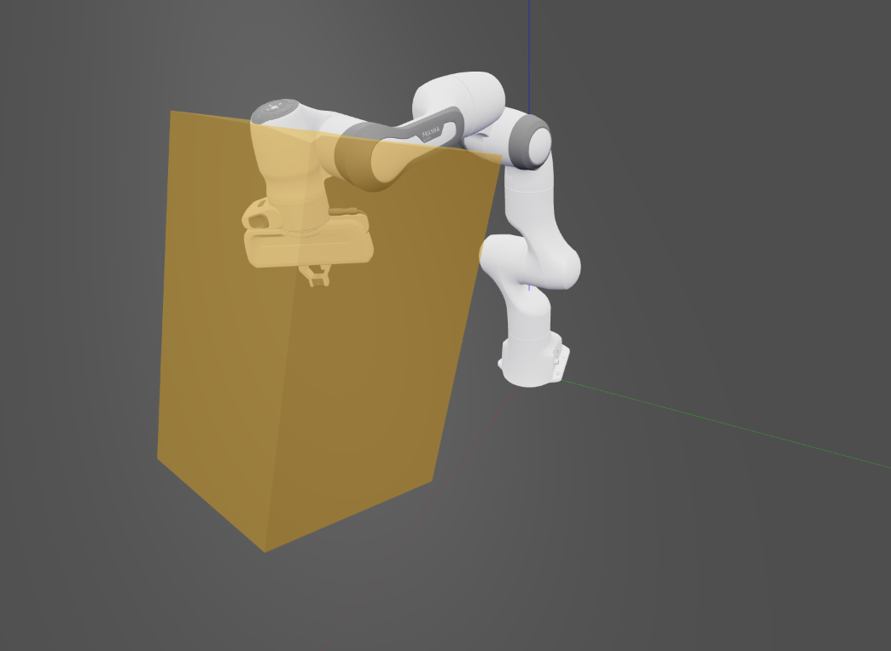
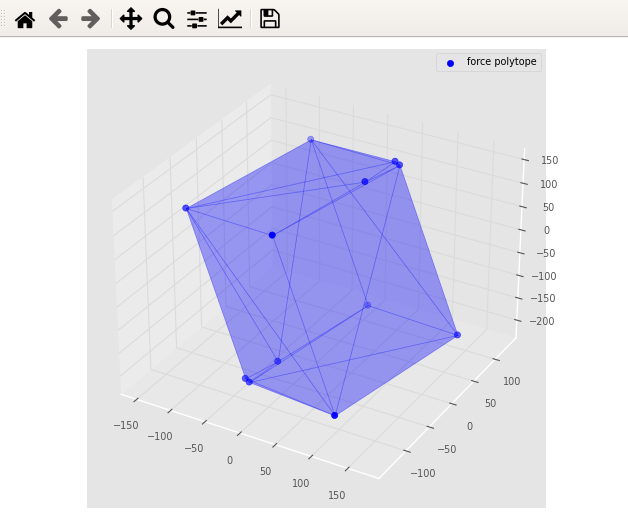

# Robotics toolbox  examples


## Installing robotics toolbox

Robotics toolbox can be easily downloaded as sa pip package or our preferred way using anaconda.
### Pip package install
```
pip install roboticstoolbox-python
```

### Anaconda install

For anaconda instals you can simply download the yaml file and save it as `env.yaml`:
```yaml
name: rtbx_examples
channels:
  - conda-forge
dependencies:
  - python=3.8
  - roboticstoolbox-python
  - numpy
  - matplotlib
  - pip
  - pip:
    - pycapacity
    - trimesh
```
And create a new ready to go environment:
```
conda env create -f env.yaml    # create the new environemnt and install robotics toolbosx, pycapacity, ...
conda actiavte rtbx_examples
```

#### Creating the custom environment from scratch
You can also simply use anaconda to create a new custom environment:
```bash
conda create -n rtbx_examples python=3.8 # create python 3.8 based environment
conda activate rtbx_examples
conda install -c conda-forge roboticstoolbox-python numpy matplotlib 
```

Then install `pycapacity` for the workspace analysis
```bash
pip install pycapacity
```

## Code example using pyplot
Calculating the force polytope of the panda robot and visualising it using the pyplot.

```python
import roboticstoolbox as rp
import numpy as np

panda = rp.models.DH.Panda()
# initial pose
q= np.array([0.00138894 ,5.98736e-05,-0.30259058,   -1.6, -6.64181e-05,    1.56995,-5.1812e-05])
panda.q = q
# joint torque limits
t_max = np.array([87, 87, 87, 87, 20, 20, 20]) 
t_min = -t_max

# polytope python module
import pycapacity.robot as pyc

# robot matrices
Jac = panda.jacob0(q)[:3,:]
# gravity torque
gravity = panda.gravload(q).reshape((-1,1))

# calculate for the polytope
f_poly =  pyc.force_polytope(Jac, t_max, t_min, gravity)

# plotting the polytope using pycapacity
import matplotlib.pyplot as plt
from pycapacity.visual import * # pycapacity visualisation tools

# visualise panda
fig = panda.plot(q)
ax = fig.ax

# draw faces and vertices
plot_polytope(plot=plt, 
              polytope=f_poly, 
              label='force polytope',
              edge_color='black', 
              alpha = 0.2, 
              show_vertices=False,
              center=panda.fkine(q).t,  # set the polytope  center at the end effector position
              scale=1/500) # scale the polytiope and place it to the end-effector

ax.set_xlim([-1, 1.5])
ax.set_ylim([-1, 1.5])
ax.set_zlim([0, 1.5])
plt.legend()
plt.show()
fig.hold()
```


## Code example using Swift
Calculating the force polytope of the panda robot and visualising it using the Swift.

```python
import roboticstoolbox as rp
import numpy as np

panda = rp.models.DH.Panda()
# initial pose
q= np.array([0.00138894 ,5.98736e-05,-0.30259058,   -1.6, -6.64181e-05,    1.56995,-5.1812e-05])
panda.q = q
# joint torque limits
t_max = np.array([87, 87, 87, 87, 20, 20, 20]) 
t_min = -t_max

# polytope python module
import pycapacity.robot as pyc

# robot matrices
Jac = panda.jacob0(q)[:3,:]
# gravity torque
gravity = panda.gravload(q).reshape((-1,1))

# calculate for the polytope
f_poly =  pyc.force_polytope(Jac, t_max, t_min, gravity)
# calculate the face representation of the polytope
f_poly.find_faces()

 # visualise panda
panda = rp.models.Panda()
import swift.Swift as Swift
panda.q = q
env = Swift()
env.launch()
env.add(panda)


# polytope visualisaation
import trimesh
# save polytope as mesh file
scaling = 500
# creathe the mesh
mesh = trimesh.Trimesh(vertices=(f_poly.vertices.T/scaling + panda.fkine(q).t),
                       faces=f_poly.face_indices, use_embree=True, validate=True)
f = open("demofile.stl", "wb")
f.write(trimesh.exchange.stl.export_stl(mesh))
f.close()
# robot visualisaiton
from spatialgeometry import Mesh
poly_mesh = Mesh('demofile.stl')
poly_mesh.color = (0.9,0.6,0.0,0.5)
env.add(poly_mesh)
```



## Code example using matplotlib
Calculating the force polytope of the panda robot only polytope using matplotlib

```python
import roboticstoolbox as rp
import numpy as np

panda = rp.models.DH.Panda()
# initial pose
q= np.array([0.00138894 ,5.98736e-05,-0.30259058,   -1.6, -6.64181e-05,    1.56995,-5.1812e-05])
panda.q = q
# joint torque limits
t_max = np.array([87, 87, 87, 87, 20, 20, 20]) 
t_min = -t_max

# polytope python module
import pycapacity.robot as pyc

# robot matrices
Jac = panda.jacob0(q)[:3,:]
# gravity torque
gravity = panda.gravload(q).reshape((-1,1))

# calculate for the polytope
f_poly =  pyc.force_polytope(Jac, t_max, t_min, gravity)

# plotting the polytope using pycapacity
import matplotlib.pyplot as plt
from pycapacity.visual import * # pycapacity visualisation tools
fig = plt.figure()

# draw polytope
plot_polytope(plot=plt, 
              polytope=f_poly, 
              label='force polytope',
              edge_color='black', 
              alpha = 0.2,)

plt.legend()
plt.show()
```
