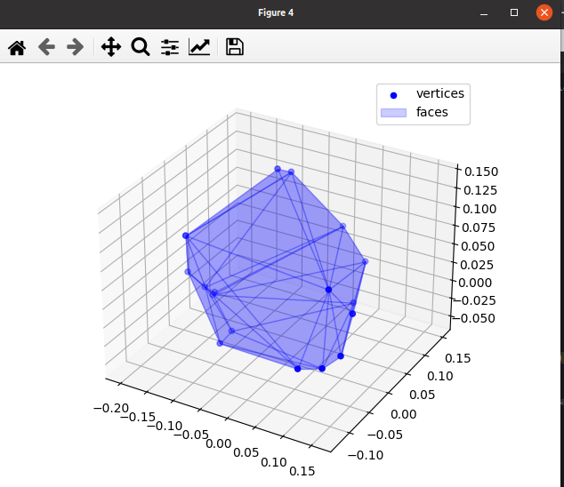

Find a vertex representation of a set of half-planes
=====================================================

A simple example program for find a vertex representation of a set of half-plane :math:`Àx\leq b`

.. code-block:: python
    
    import pycapacity.algorithms as algos # algos module
    import numpy as np

    N = 100 # hundred inequalities (half planes)
    m = 3   # space dimension

    # define the inequalities
    A = np.random.rand(N,m)*2-1
    b = np.random.rand(N)

    # find vertices and faces
    verts, face_indices = algos.hspace_to_vertex(A,b)

    # check if zero is inside the polytope
    print('No vertices found: ', verts.shape[1])

    # visualise the polytope found 
    # face indices to faces
    faces = algos.face_index_to_vertex(verts, face_indices)

    # plotting the polytope
    import matplotlib.pyplot as plt
    from pycapacity.visual import plot_polytope_faces, plot_polytope_vertex # pycapacity visualisation tools
    fig = plt.figure(4)

    # draw faces and vertices
    ax = plot_polytope_vertex(plt=plt, vertex=verts, label='vertices',color='blue')
    plot_polytope_faces(ax=ax, faces=faces, face_color='blue', edge_color='blue', label='faces', alpha=0.2)

    plt.tight_layout()
    plt.legend()
    plt.show()

The output of this program will be an image vitvisualised vertices and faces of the specified inequalities :math:`Àx\leq b`

