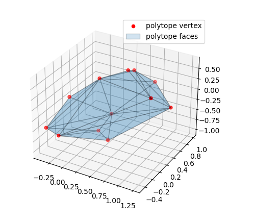

Find a vertex representation of a set of half-planes
=====================================================

A simple example program for find a vertex representation of a set of half-plane :math:`Àx\leq b`

.. code-block:: python
        
    from pycapacity.objects import Polytope # import polytope object
    import numpy as np

    N = 100 # hundred inequalities (half planes)
    m = 3   # space dimension

    # this seed is used to generate the same image 
    # as in the examples in the docs 
    np.random.seed(12345)

    # define the inequalities
    A = np.random.rand(N,m)*10-5
    b = np.random.rand(N)*50

    # generate the polytope object
    p = Polytope(H=A,d=b)
    # find the vertices
    p.find_vertices()

    # print the vertices number
    print('Number of vertices found: ', p.vertices.shape[1])

    # visualise the polytope found 
    # plotting the polytope
    import matplotlib.pyplot as plt
    from pycapacity.visual import *
    fig = plt.figure(4)

    # draw faces and vertices
    plot_polytope(plot=plt, 
                    polytope=p, 
                    label='polytope', 
                    edge_color='black', 
                    vertex_color='red', 
                    alpha=0.2)

    plt.legend()
    plt.show()

The output of this program will be an image visualised vertices and faces of the specified inequalities :math:`Àx\leq b`

Classify points in or out the polytope
--------------------------------------

.. code-block:: python

    # generate points to classify
    points_to_classify = np.array(np.random.rand(m,N))*2.5-1.25 # points

    # classify the points
    points_in, points_out = [], []
    for point in points_to_classify.T:
        if np.all(A@point <= b):
            points_in.append(point)
        else:
            points_out.append(point)
    points_in = np.array(points_in).T
    points_out = np.array(points_out).T

    # plotting the polytope and the points
    fig = plt.figure(5)

    # draw faces and vertices
    plot_polytope(plot=plt, 
                    polytope=p, 
                    label='polytope', 
                    edge_color='black', 
                    show_vertices=False, 
                    alpha=0.2)
    # points out in red 
    plt.plot(points_out[0,:],points_out[1,:],points_out[2,:],'ro',label='points out')
    # point in in green
    plt.plot(points_in[0,:],points_in[1,:],points_in[2,:],'go',label='points in')
    plt.legend()
    plt.show()

The output of this program will be an image of visualised classified points in or out the inequalities :math:`Àx\leq b`

.. image:: ../images/h2v_in_out.png